## Windows

### Install Opencv

1. download and install ([opencv Releases](https://opencv.org/releases/))

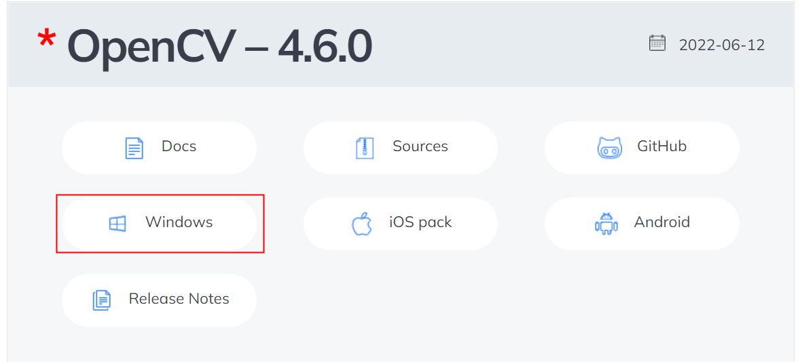

2. add environment variable

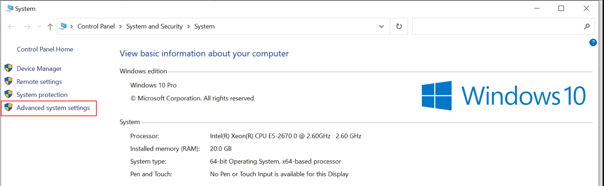
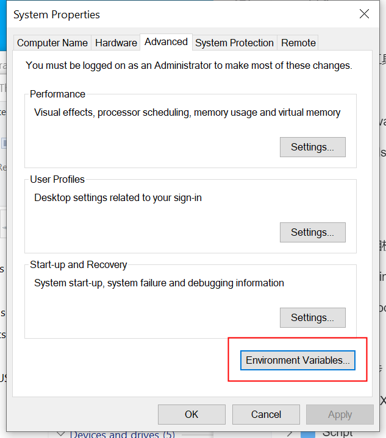
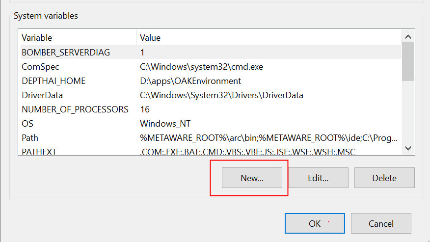
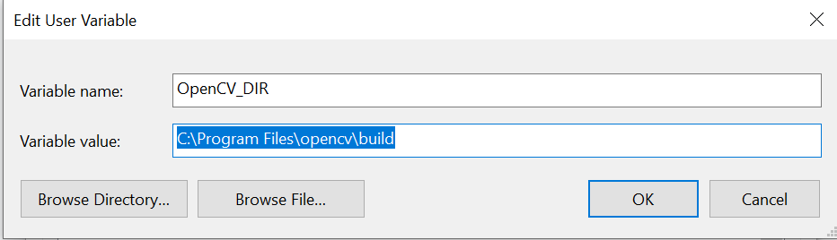

### Install Driver

[Dowload Driver](https://github.com/ArduCAM/ArduCAM_USB_Camera_Shield/releases/download/install_drivers/install_USB_Camera_Drivers.zip)

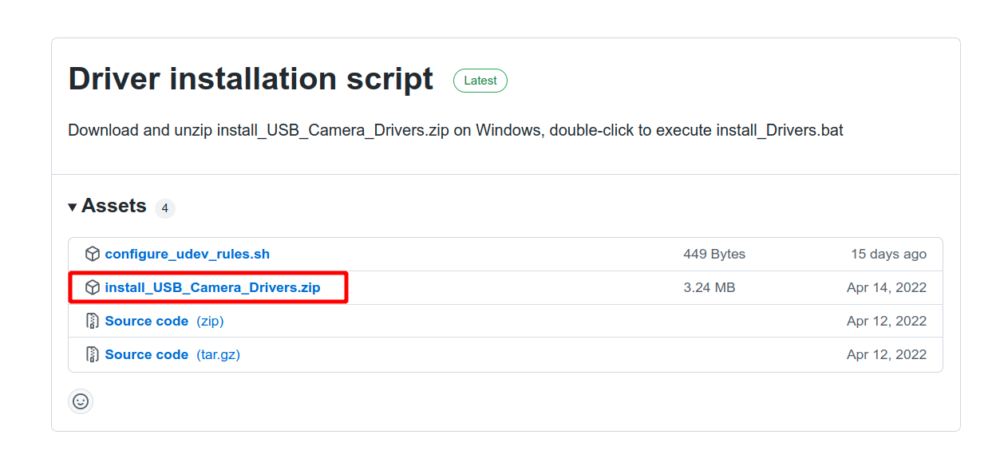

Unzip the package after the download is complete.

Double-click to execute the install_driver.bat file.

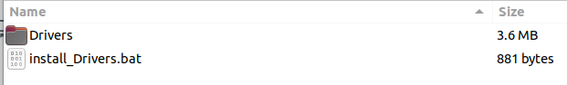

### Build

1. Command Line Compilation

get source code

```
git clone https://github.com/ArduCAM/ArduCAM_USB_Camera_Shield_Cpp_Demo.git
cd ArduCAM_USB_Camera_Shield_Cpp_Demo
```

Create the build directory in the project directory

```
cd build
cmake -DCMAKE_GENERATOR_PLATFORM=x64 ..
cmake --build . --config Release
```

After the compilation is complete, the following files will be generated in the build directory.

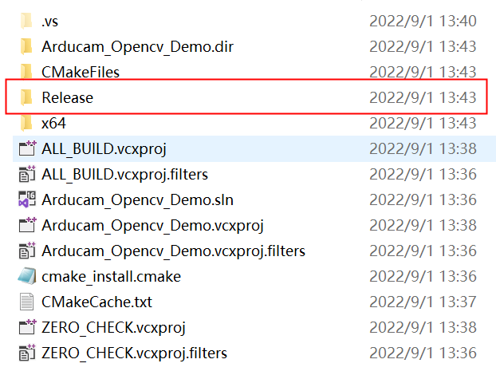

Enter the Release directory to see the compiled executable program.

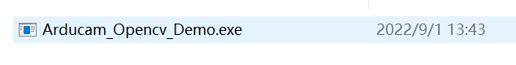

Copy the compiled executable program to the same folder of the dynamic link library.

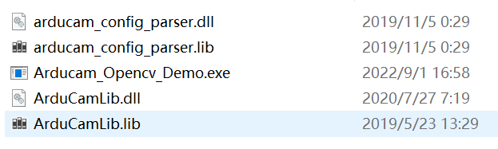

Execute the Arducam_Opencv_Demo program. According to the prompts, you need to set the configuration file path.

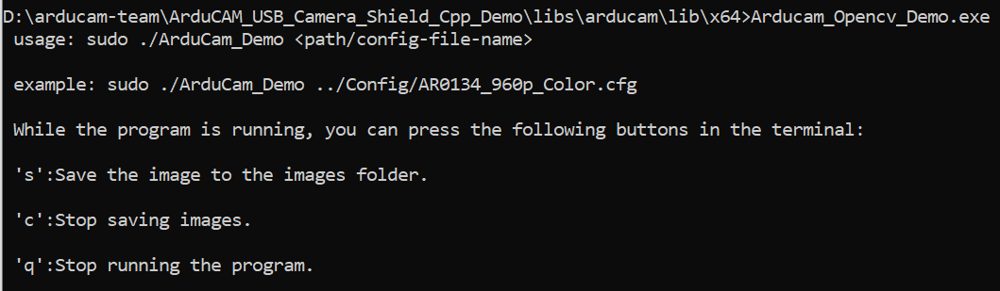

2. cmake-gui

Use the cmake visualizer to generate project files.

Select the project directory and build directory.

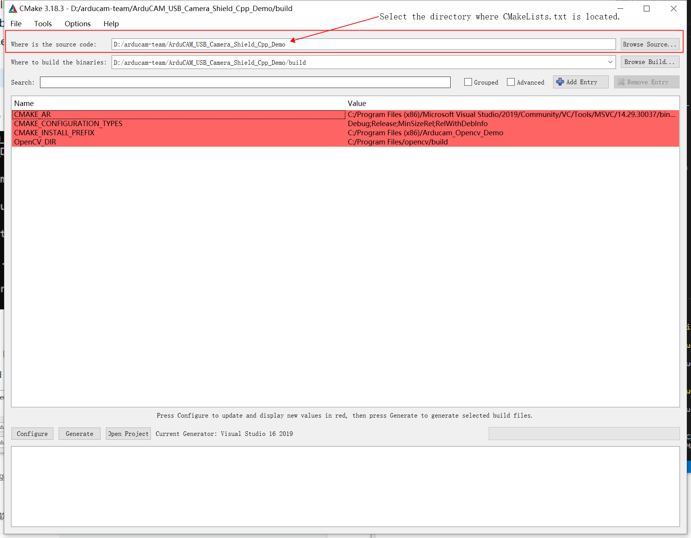

Generate project files.

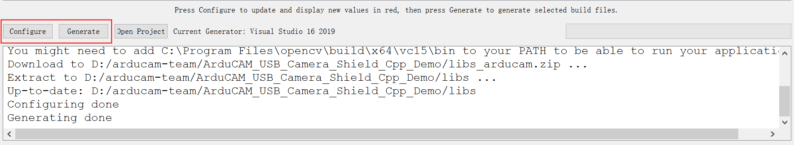

Select the generator.

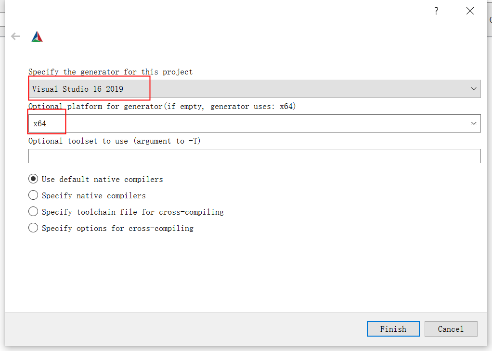

Open the project with Visual Studio.

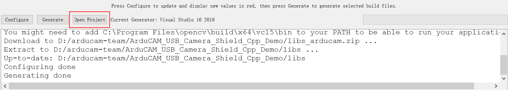

Debug 

First add command line arguments.


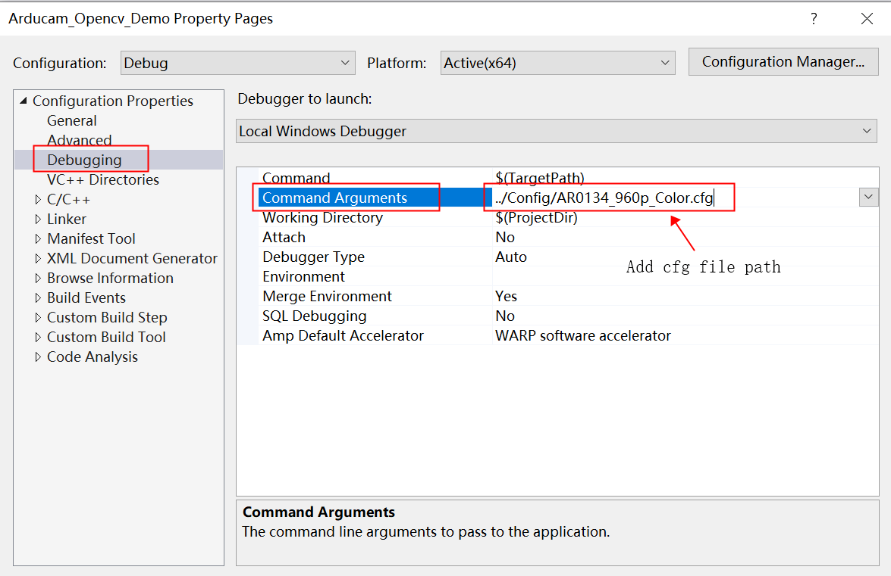

Set the dynamic link library path.

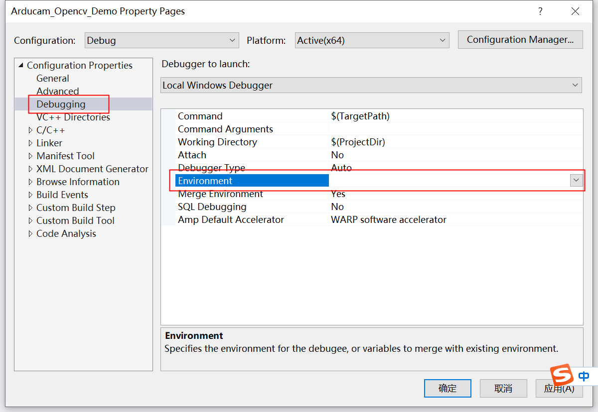

Add the dynamic library path, pay attention to be sure to add ***"PATH="*** in front.

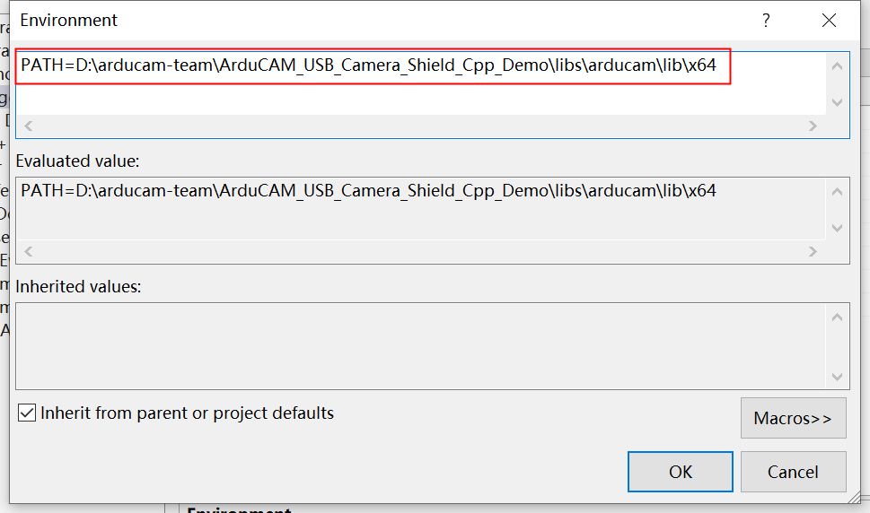

perform debugging.

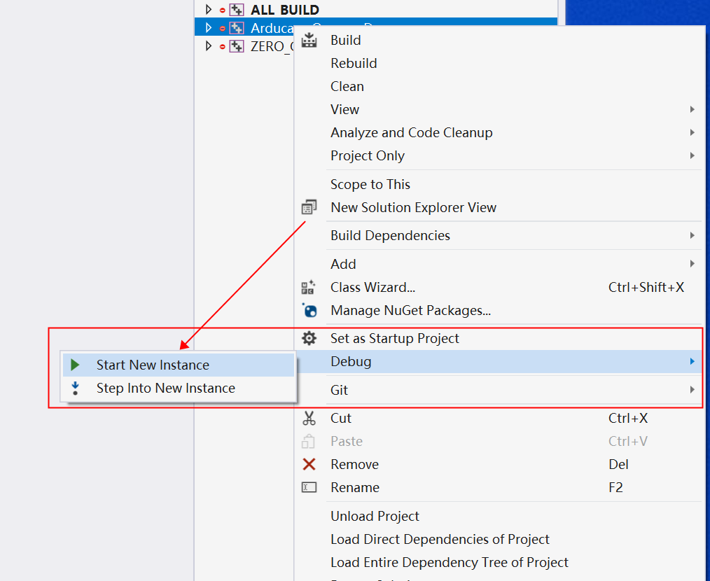

Build

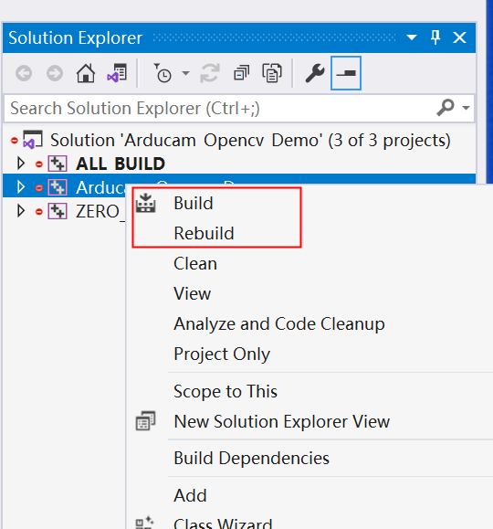
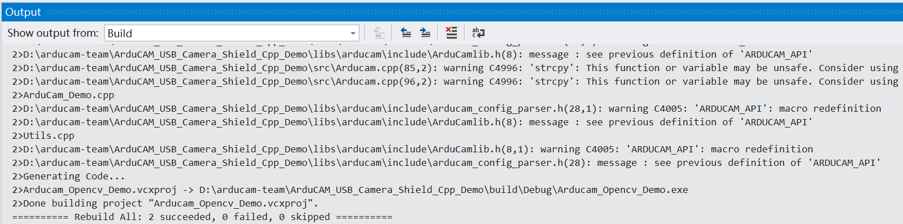


**Note: Configuration files can be found here: [ArduCAM_USB_Camera_Shield](https://github.com/ArduCAM/ArduCAM_USB_Camera_Shield/tree/master/Config)**