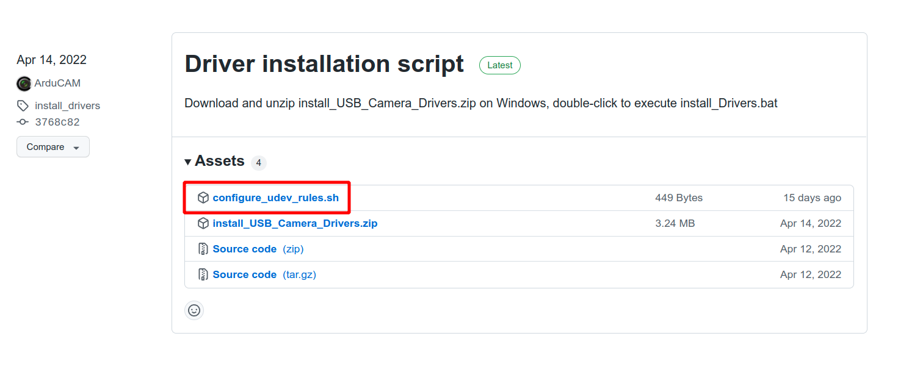

# Introduction

## [Build On Windows](Build_Windows.md)

## Linux

## Installation dependence

1. opencv
2. arducam-usb-sdk-dev
3. arducam-config-parser-dev

```
sudo apt install libopencv-dev

curl -s --compressed "https://arducam.github.io/arducam_ppa/KEY.gpg" | sudo apt-key add -
sudo curl -s --compressed -o /etc/apt/sources.list.d/arducam_list_files.list "https://arducam.github.io/arducam_ppa/arducam_list_files.list"
sudo apt update
sudo apt install arducam-config-parser-dev arducam-usb-sdk-dev
```

### set udev rules

[Download script](https://github.com/ArduCAM/ArduCAM_USB_Camera_Shield/releases/download/install_drivers/configure_udev_rules.sh)



execute script

```
sudo chmod +x configure_udev_rules.sh
./configure_udev_rules.sh
```

### Build

```
git clone https://github.com/ArduCAM/ArduCAM_USB_Camera_Shield_Cpp_Demo.git
cd ArduCAM_USB_Camera_Shield_Cpp_Demo
mkdir build && cd build
cmake ..
make -j2
```

### Run

```
./Arducam_Opencv_Demo <path/config-file-name>
```

**Note: Configuration files can be found here: [ArduCAM_USB_Camera_Shield](https://github.com/ArduCAM/ArduCAM_USB_Camera_Shield/tree/master/Config)**